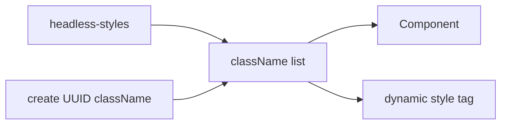
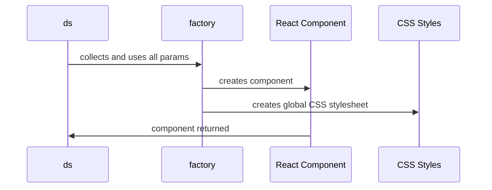

- Start Date: 2002-02-17
- RFC PR: (leave this empty)
- TVA Issue: (leave this empty)

# Summary

Create a package that delivers React specific components using a design that is highly influenced by the [styled-components](https://styled-components.com/) library (SC).

# Basic example

For a Button, there could be different levels of usage from out-of-box support to custom extensions. The base-level API for the `props` of each component should use the `headless-styles` API.

**Basic**
```jsx
import ds from '@pluralsight/design-components'

const Button = ds.button()

function SomePage() {
  return (
    ...
    <Button kind="outlined">Outlined Button</Button>
  )
}
```

**Advanced**
```jsx
import ds from '@pluralsight/design-components'

const Button = ds.button`
  background-color: #00000;
  transition: background-color 250ms ease-out;

  &:hover {
    background-color: #FFFFFF;
  }
`

function SomePage() {
  return (
    ...
    <Button type="submit">Custom Button</Button>
  )
}

```

The overall design should mimick what SC does except instead of returning JSX tags, we are returning PS components.

# Motivation

**Why are we doing this? What use cases does it support? What is the expected outcome?**

As of today, we provide a mutli-level tooling system focusing around flexibility that allows all users at Pluralsight to accomplish anything they want for using branded styles and having full ownership of components. This design fills the remaining gap of having a  library specific to React that provides flexibility while keeping ownership within the component (vs. their team).

> TLDR; This is a library for people who want "miminum" flexibility.

The use case it supports are for teams who do not want to own their own components (or may not have the time to), while still providing a library that creates a feeling of "enjoyment" to use. Additionally, without forcing an actual component definition onto the user (classic PSDS vs. a factory creator) it allows for a more flexible system because we are using the React API vs the high level component API (JSX).

The expected outcome is to provide a library that is flexible enough to use without forcing our team to re-create controlled components to the level that basic UI libraries do (classic, MUI, Chakra, etc.).

# Detailed design

The design would follow the `styled-components` foundation of being a utility function-driven framework (vs. component definitions) that uses the React API [createElement](https://reactjs.org/docs/react-api.html#createelement) function in combination of [stylis](https://github.com/thysultan/stylis) which allows us to process the CSS string being passed in as a parameter as seen in the examples.

By doing this, we bypass most needs to use JSX which allows us to be more sustainable over time (i.e., when a major change happens in React - we are less likely to be impacted). Also, because we are essentially "building" components using the lower-level API, we can still utilize context, hooks, and other React API's when needed.

## What does `ds` mean and why are we exporting it?

The center of the library is the `ds` Object where we have a property for each component that we have available. This is the same pattern that SC uses, however, they return normal JSX tags (i.e. button, input, ul, etc.).

So, let's pretend we have 3 components in our UI library: `Button`, `AlertDialog`, and `Slider`. Each would be available on the `ds` object as the camel-cased version of the names. The reasons behind this are so that we reserve the casing name for the actual components in our code base.

*This is important because any function that is created in the React space using the capital-casing are assumed to be components and will be treated as such*

This is also why so many teams have poor rendering pages due to using the `createXComponent` function pattern. Even though that function returns JSX, because it is not capital-cased, React does not register it as a component and will not keep track of it in the VirtualDOM.

Likewise, there may come a point in time where we may want to utilize the actual components in a new way. Thus, reserving the name casing allows us to have more flexibility if we need in the future.

So, at a very high level, you can think of the `ds` Object as a [Set](https://developer.mozilla.org/en-US/docs/Web/JavaScript/Reference/Global_Objects/Set) which stores components but we are really doing more complex things under the hood.

**Visual**
```javascript
// What you think ds is...

const ds = {
  alertDialog: AlertDialog
  button: Button,
  slider: Slider
}

// What it actually is (from a birds eye view)

const ds = {
  alertDialog: componentFactory(options)
  ...
}
```

## How do we get the component then?

Now that we understand `ds`, we can understand how each component is delivered. At the highest level, each call of `ds.someComponent` would actually call our factory function which is defined from a constructor we create:

```javascript
// A VERY VERY HIGH LEVEL APPROACH

function ds(componentTag: PSComponent) {
  // this returns a function that uses these params internally
  // and accepts a new param of cssStyles (a string of CSS syntax)
  // which is used in the "Advanced" example above
  return constructWithOptions(createDSComponent, componentTag)
}

// Our original ds Object
const enhancedDS = {}

// Build ds object
PSComponentList.forEach(tag => {
  enhancedDS[tag] = ds(tag)
})

export default enhancedDS
```

From the high-level example, we can see how the `ds` Object is created and get a sense of the basic approach to the factory function. But there is of course more to it.

## What about the styles?

The only gap left to fill in for this concept is how we are using the stringified CSS styles being passed in as a parameter when people need to extend our components. This is where Stylis comes in (a light-weight CSS preprocessor).

Stylis allows us to parse read, serialize, parse (pretty much anything), or what-have you the String based styles users pass as a parameter. What is more, it also allows concepts like nesting to be used. This is how we interpret the styles for usage.

### Applying the styles

To apply the styles, we will essentially create a global style-sheet via a dynamic `style` tag in the html `head` and associate unique identifiers to components in the form of a `className` to use along side our `headless-styles` props.

This is the latest design currently used by SC which has changed due to this new direction being more performant than creating an actual stylesheet to `link` in the `head`.


With each update (during development), we are essentially rehydrating the `style` contents with the updated styles being used. In production, this would work the same except there is no rehydration by nature.

<br>

## A Visual Concept

If we had a visual for the entire process of calling `ds.button`, it would look like so:



To sum up everything - the factory is the source of truth vs. a component definition.

## How are components created then?

The factory would use the `createElement` function and use the `targetElement` and `tag` props to source a `buttonConfig` function that returns an Object of everything the `createElement` function expects. This allows us to keep all components as flexible as possible and not relying on JSX.

Here is an example of what our `Button` would actually look like:

```javascript
// Button.js

import {getButtonProps} from '@pluralsight/headless-styles'
import {createUID} from '.../somePlace'

export default function buttonConfig(styledProps) {
  const {className, ...psBtnProps} = getButtonProps(styledProps)

  return {
    tag: 'button',
    tagProps: {
      className: `${className} ${createUID()}`,
      ...psBtnProps
    },
  }
}

// Our Factory

const dsElement = componentMap[tag]
...
createElement(dsElement.tag, {
  ...dsElement.tagProps
})
```

This the the same design and concept that the Relay team uses to cache and configure Routes for React apps (it's basically what Facebook does in their current app) which is why it is so fast.

This of course is an example of a very light-weight component. In rare use cases (complex components like a Menu), we may need to use JSX. However, it should be kept as minimal as possible.

# Drawbacks

In terms of implementation cost, this will be the most complex library we have to date and it will take longer to build due to a more complex setup.

However all other aspects

- can it be implemented in a safe space?
- the impact of teaching people?
- integration of this with existing libraries/features?
- cost of migrating existing TVA apps

are very minimal since this pattern is familiar with the React audience and it is an approach that works along with our other libraries.

# Alternatives

Other alternatives to this approach would be creating a basic JSX controlled approach that is commonly done by most teams (and what classic did in the past).

# Adoption strategy

If we implement this proposal, existing TVA developers should adopt it at their own choice of either:

1. Use it along side the headless-styles to build new components
2. Replacing the headless component solution they own

Since this is an additional library that solves a different problem, there will be no breaking changes to our existing ones and should be coordinated with them.

# How we teach this

I think basing the docs for this package roughly on the same outline SC uses would help people understand it faster since it is extending from that design and so many engineers are already using that library.

Having said that, we would need to add a new "packages" section for "components" but it shouldn't cange how TVA is already taught as a whole. It's more like adding a new feature to the overall library suite.

For existing developers, I think it's as easy as saying we have a new library that delivers a component-based solution that is similar to SCs.

# Unresolved questions

**1. Should we just copy/paste the current SC lib into our workspace for a quicker starting point? This does make the library much more complex, but will possible give us more features out the door?**

If we start from scratch, we can keep it lighter weight and remove unnecessary clutter.
